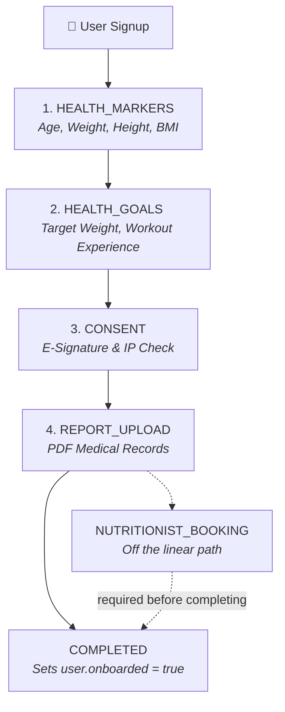

# Fitflix Backend API (HybridHuman) 🚀🏋️‍♂️

[](https://bun.sh)
[](https://expressjs.com)
[](https://www.typescriptlang.org/)
[](https://www.mongodb.com/)
[](https://mongoosejs.com/)
[](https://zod.dev/)
[](https://biomejs.dev)
[](https://vercel.com)

> **The high-performance, strictly typed engine powering the Fitflix ecosystem.**  
> Serving the **Fitflix Flutter app** (for users) and the **FrontDesk Fitflix dashboard** (for admin/doctors/trainers). Deployed seamlessly on Vercel Serverless.

---

## 🌟 Key Capabilities

*   🛡️ **Role-Based Access Control (RBAC)**: Secure routes tailored for `user`, `admin`, `doctor`, and `trainer` roles.
*   🧠 **State-Enforced Onboarding**: Single-source-of-truth 7-step onboarding flow strictly validated on the backend.
*   ⚡ **Modern Runtime**: Powered by **Bun** and **TypeScript** for super-fast startup and execution.
*   🔗 **Real-Time Websockets**: Built-in **Socket.io** integration for bi-directional live updates.
*   📅 **Smart Scheduling & Bookings**: Slot templates, appointments, and membership credit validation/ledgers.
*   📊 **Health Metrics Parsing**: Automatically calculates BMI, tracks health markers, and parses PDF medical reports using OpenAI LLM integration.

---

## 🏗️ Folder Structure

```
FITFLIX_BACKEND/
├── index.ts                  # Main entry point (db connection, HTTP & WebSocket initialization)
├── api/
│   └── index.ts              # Vercel serverless function wrapper
├── src/
│   ├── app.ts                # Express setup, middleware chains, & API router mounts
│   ├── models/               # Mongoose database schemas & TypeScript schema definitions
│   ├── controllers/          # Business logic handlers (functional-style request handlers)
│   ├── routes/               # API route definitions and endpoint middleware
│   ├── middleware/           # JWT verification, Role checks, and rate limiting
│   ├── validators/           # Strict request-payload schemas powered by Zod
│   ├── utils/                # Helper utilities (credit ledger, onboarding engine, LLM parser)
│   └── types/                # Custom TypeScript definitions & declaration merges
├── scripts/                  # Admin commands, database seeders, and migration utilities
└── tests/                    # E2E & integration test suites
```

---

## 🧭 Onboarding Workflow System

The backend enforces a strict state machine for user onboarding. Users cannot skip steps, and the mobile/web clients follow the state dictated by the `/onboarding/status` endpoint.



`STEP_ORDER` is the four solid steps plus `COMPLETED`. `NUTRITIONIST_BOOKING` is
not part of that sequence — the booking can be made at any point, but
`POST /onboarding/complete` fails with `MISSING_STEPS` unless a non-`REJECTED`
nutritionist booking exists. There is no sports-scientist step.

### Onboarding API Endpoints (`/onboarding/*`)

| Method | Path | Purpose |
| :--- | :--- | :--- |
| **GET** | `/onboarding/status` | Retrieves current step, list of completed steps, and next steps |
| **POST** | `/onboarding/health-markers` | Submits core physical metrics; auto-calculates BMI |
| **POST** | `/onboarding/health-goals` | Submits dietary preferences, physical limits, and training goals |
| **POST** | `/onboarding/consent` | Captures digital signature and IP address for terms consent |
| **POST** | `/onboarding/reports` | Uploads PDF medical reports (multipart `file`) |
| **POST** | `/onboarding/complete` | Validates that all prerequisites are satisfied and unlocks full app |
| **POST** | `/nutritionist/book` | Books the nutritionist consult (also at `/onboarding/nutritionist/book`) |

> Full endpoint reference: **[docs/API_REFERENCE.md](docs/API_REFERENCE.md)**.

---

## ⚙️ Environment Configuration

Copy `.env.example` to `.env` or `.env.local` and configure:

| Variable | Required | Description | Default |
| :--- | :--- | :--- | :--- |
| `MONGODB_URL` | **Yes** | Connection string for MongoDB | — |
| `JWT_SECRET` | **Yes** | Encryption key used to sign access tokens | — |
| `PORT` | No | Server binding port | `3000` |
| `JWT_EXPIRES_IN`| No | Token life window | `12h` |
| `ENABLE_GMAIL_WATCH`| No | Enables Gmail watch polling for automated medical reports | `false` |
| `PUBSUB_TOPIC` | No | Pub/Sub topic for Google Cloud notifications | — |

---

## 🚀 Local Development Setup

Get the environment up and running on your local machine.

### 1️⃣ Prerequisites
- Install **Bun** runtime:
  ```bash
  powershell -c "irm bun.sh/install.ps1 | iex"  # Windows
  # or
  curl -fsSL https://bun.sh/install | bash      # macOS / Linux
  ```
- Running instance of **MongoDB** (local or Atlas cluster).

### 2️⃣ Clone & Install
```bash
git clone https://github.com/Emporio-Labs/FITFLIX_BACKEND.git
cd FITFLIX_BACKEND
bun install
```

### 3️⃣ Configure Environment
```bash
cp .env.example .env
```
Open `.env` and fill in your `MONGODB_URL` and `JWT_SECRET`.

### 4️⃣ Seed Database & Create Admin
Bootstrap default system exercises and create an initial admin login:
```bash
bun run seed:exercises
bun run create:admin
```

### 5️⃣ Run the Server
```bash
bun run dev
```
The server will start at `http://localhost:3000`.

---

## 🛠️ CLI Helper Commands

The project comes with several helpful pre-configured scripts:

| Command | Action |
| :--- | :--- |
| `bun run dev` | Starts the Express server in hot-reload mode |
| `bun run create:admin` | Prompts for credentials to insert a new backend admin |
| `bun run seed:exercises` | Populates the database with default library exercises |
| `bun run import:meal-plan` | Parses and loads standardized dietary templates from excel files |
| `bun run test:onboarding-flow` | Runs the full E2E onboarding validation tests |

---

## 🛡️ License

This project is private and proprietary. Unauthorized copying, distribution, or use is strictly prohibited. All rights reserved by **Emporio Labs**.

---

## ✉️ Contact

For infrastructure access, deployment questions, or issues:
- **Lead Developers**: Emporio Labs Engineering Team
- **Issue Tracker**: GitHub Repository Issues page
- **Deployment Endpoint**: [https://hybridhuman-backend.vercel.app](https://hybridhuman-backend.vercel.app)
