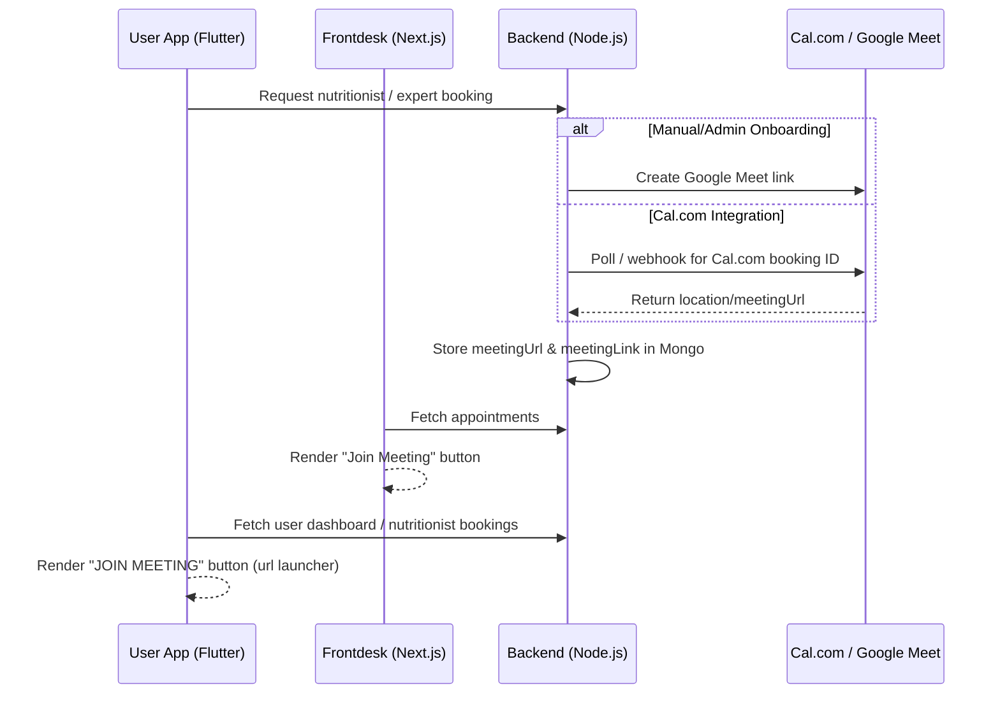

# Meeting URL Integration Analysis: FitFlix Repositories

This document maps all files, database fields, and components related to the **Meeting URL / Meeting Link** functionality across the three FitFlix repositories:
- **`FITFLIX_BACKEND`**
- **`USER-APP-FITFLIX` (Flutter Mobile)**
- **`frontdesk-fitflix` (Next.js Admin)**

---

## 🗺️ Architectural Overview

The application utilizes meeting URLs (Google Meet or Cal.com links) to connect users with experts (nutritionists and sports scientists).

---

## 📂 Repository Category: `FITFLIX_BACKEND`

The backend manages database schemas, Cal.com webhook processing, background polling for meeting URLs, and Google Meet generation.

### 🗄️ Database Models
*   #### [ExpertAppointment.ts](file:///c:/Users/Yeshwanth/Yugaas/github_clones/FITFLIX_BACKEND/src/models/ExpertAppointment.ts)
    *   **Fields**:
        *   `meetingLink`: Legacy field kept for backward compatibility.
        *   `meetingUrl`: New field storing the active meeting URL.
*   #### [NutritionistBooking.ts](file:///c:/Users/Yeshwanth/Yugaas/github_clones/FITFLIX_BACKEND/src/models/NutritionistBooking.ts)
    *   **Fields**:
        *   `meetingLink`: Stores the Google Meet or Cal.com meeting URL for the nutritionist consultation.

### ⚙️ Controllers & Business Logic
*   #### [expert-appointment.controller.ts](file:///c:/Users/Yeshwanth/Yugaas/github_clones/FITFLIX_BACKEND/src/controllers/expert-appointment.controller.ts)
    *   Initiates background polling via `calidService.startBackgroundPollForMeetingUrl` if the booking is online but Cal.com hasn't generated the final URL yet.
*   #### [nutritionist-booking.controller.ts](file:///c:/Users/Yeshwanth/Yugaas/github_clones/FITFLIX_BACKEND/src/controllers/nutritionist-booking.controller.ts)
    *   Handles accepting nutritionist bookings, updating/mapping `meetingLink`, generating links, and polling for the final URL from Cal.com.
*   #### [onboarding.controller.ts](file:///c:/Users/Yeshwanth/Yugaas/github_clones/FITFLIX_BACKEND/src/controllers/onboarding.controller.ts)
    *   Automatically generates a Google Meet link using `createGoogleMeetLink` during steps 5/6 of onboarding if no meeting link is pre-existing.
*   #### [user.controller.ts](file:///c:/Users/Yeshwanth/Yugaas/github_clones/FITFLIX_BACKEND/src/controllers/user.controller.ts)
    *   Returns the latest direct appointment's `meetingLink` to the client.

### 🔗 Integrations (Cal.com & Webhooks)
*   #### [calid.mapper.ts](file:///c:/Users/Yeshwanth/Yugaas/github_clones/FITFLIX_BACKEND/src/integrations/calid/calid.mapper.ts)
    *   Defines helper functions:
        *   `isValidMeetingUrl`: Validates URL format.
        *   `extractMeetingUrl`: Extracts URLs from `booking.meetingUrl` or `booking.location`.
        *   `cleanOrFallbackMeetingUrl`: Filters/sanitizes meeting URLs and maps them.
*   #### [calid.service.ts](file:///c:/Users/Yeshwanth/Yugaas/github_clones/FITFLIX_BACKEND/src/integrations/calid/calid.service.ts)
    *   Implements `startBackgroundPollForMeetingUrl` which periodically polls the Cal.com API for a valid meeting URL and updates the MongoDB document once it is created.
*   #### [calid.webhook.ts](file:///c:/Users/Yeshwanth/Yugaas/github_clones/FITFLIX_BACKEND/src/integrations/calid/calid.webhook.ts)
    *   Processes webhooks sent by Cal.com when a booking is created or modified. It parses the payload, extracts `meetingUrl`, sanitizes it, and saves it to the database.
*   #### [calid.client.ts](file:///c:/Users/Yeshwanth/Yugaas/github_clones/FITFLIX_BACKEND/src/integrations/calid/calid.client.ts) & [calid.types.ts](file:///c:/Users/Yeshwanth/Yugaas/github_clones/FITFLIX_BACKEND/src/integrations/calid/calid.types.ts)
    *   Define API client logic and typings for interacting with Cal.com API responses.

### 🛡️ Validation & Services
*   #### [onboarding.service.ts](file:///c:/Users/Yeshwanth/Yugaas/github_clones/FITFLIX_BACKEND/src/utils/onboarding.service.ts)
    *   Normalizes and maps `meetingUrl`/`meetingLink` properties between legacy schemas and new records.
*   #### [nutritionist-booking.validator.ts](file:///c:/Users/Yeshwanth/Yugaas/github_clones/FITFLIX_BACKEND/src/validators/nutritionist-booking.validator.ts) & [onboarding.validator.ts](file:///c:/Users/Yeshwanth/Yugaas/github_clones/FITFLIX_BACKEND/src/validators/onboarding.validator.ts)
    *   Validate that inputs for meeting links are properly formatted strings and URLs.

---

## 📱 Repository Category: `USER-APP-FITFLIX` (Mobile App)

The mobile client consumes the backend APIs, parses booking models, and presents the "Join Meeting" UI to the end user.

### 📐 Data Models & API Endpoints
*   #### [endpoints.dart](file:///c:/Users/Yeshwanth/Yugaas/github_clones/USER-APP-FITFLIX/lib/data/api/endpoints.dart)
    *   Defines endpoint: `/nutritionist/my-booking/switch-to-online` (`switchNutritionistMeetingToOnline`).
*   #### [onboarding_repository.dart](file:///c:/Users/Yeshwanth/Yugaas/github_clones/USER-APP-FITFLIX/lib/data/repository/onboarding_repository.dart)
    *   Handles posting meeting links during onboarding and switching consultations to online mode.
*   #### [models.dart](file:///c:/Users/Yeshwanth/Yugaas/github_clones/USER-APP-FITFLIX/lib/features/nutritionist_booking/models.dart)
    *   Implements the `NutritionistBooking` model. Reads and maps keys from JSON response (handles `meetingLink`, `meetingUrl`, or `joinUrl` fallback).

### 🖥️ Screens & Widgets
*   #### [booking_status_card.dart](file:///c:/Users/Yeshwanth/Yugaas/github_clones/USER-APP-FITFLIX/lib/features/nutritionist_booking/widgets/booking_status_card.dart)
    *   Renders the `_JoinMeetingButton` class:
        *   If `meetingLink` is not empty, shows **JOIN MEETING**. Clicking copies it to clipboard and launches it.
        *   If `meetingLink` is null/empty, shows **MEETING LINK PENDING**.
*   #### [nutritionist_booking_view.dart](file:///c:/Users/Yeshwanth/Yugaas/github_clones/USER-APP-FITFLIX/lib/features/nutritionist_booking/widgets/nutritionist_booking_view.dart)
    *   Handles launching the URL in the system browser using `_openMeetingLink` and reports errors if the link is invalid.
*   #### [dashboard_screen.dart](file:///c:/Users/Yeshwanth/Yugaas/github_clones/USER-APP-FITFLIX/lib/screens/dashboard_screen.dart)
    *   Renders upcoming expert/nutritionist bookings on the main dashboard screen and lets users open the meeting link directly.
*   #### [nutrition_hub_screen.dart](file:///c:/Users/Yeshwanth/Yugaas/github_clones/USER-APP-FITFLIX/lib/screens/nutrition_hub_screen.dart)
    *   Main screen for nutrition plans and nutritionist appointments. Provides the primary entry point to join nutritionist consultations.

---

## 💻 Repository Category: `frontdesk-fitflix` (Admin Portal)

The admin portal allows administrators and nutritionists to review appointments, manually update meeting links, and join scheduled calls.

### 🌐 Pages & Router
*   #### [page.tsx (Nutrition Admin)](file:///c:/Users/Yeshwanth/Yugaas/github_clones/frontdesk-fitflix/app/admin/nutrition/page.tsx)
    *   Renders the nutritionist booking table. Lists meeting links using `appt?.meetingLink || appt?.meetingUrl`.
*   #### [page.tsx (User Admin)](file:///c:/Users/Yeshwanth/Yugaas/github_clones/frontdesk-fitflix/app/admin/users/[id]/page.tsx)
    *   Displays the meeting link details in the admin profile view for a specific member.

### 🧩 Components & Services
*   #### [clinical-user-dialog.tsx](file:///c:/Users/Yeshwanth/Yugaas/github_clones/frontdesk-fitflix/components/nutrition/clinical-user-dialog.tsx)
    *   Renders a dialog with a button to directly "Join meeting" using the nutritionist appointment's `meetingLink`.
*   #### [nutritionist-appointments-tab.tsx](file:///c:/Users/Yeshwanth/Yugaas/github_clones/frontdesk-fitflix/components/nutrition/nutritionist-appointments-tab.tsx)
    *   Renders appointment details. Shows a "Join Meeting" action button or displays "Meeting link will be generated after approval" if pending.
*   #### [nutritionist-booking.service.ts](file:///c:/Users/Yeshwanth/Yugaas/github_clones/frontdesk-fitflix/lib/services/nutritionist-booking.service.ts) & [onboarding.service.ts](file:///c:/Users/Yeshwanth/Yugaas/github_clones/frontdesk-fitflix/lib/services/onboarding.service.ts)
    *   Wrap administrative APIs for fetching and updating nutritionist bookings, including setting `meetingLink` and `meetingUrl`.

---

## 📌 Summary Table: Legacy vs. Current Fields

| Repo | Key Fields | Primary Uses |
| :--- | :--- | :--- |
| **Backend** | `meetingUrl`, `meetingLink` | `meetingUrl` is the primary database field. `meetingLink` is synchronized/fallback for backward compatibility with older clients. |
| **User App (Mobile)** | `meetingLink` | Reads `meetingLink`, `meetingUrl`, or `joinUrl` from JSON and launches the platform browser/app. |
| **Frontdesk (Admin)** | `meetingLink`, `meetingUrl` | Shows meeting link to admin, falls back to `meetingUrl` if `meetingLink` is absent. |
